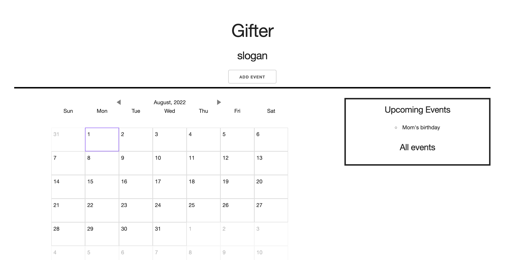

# Gifter

## Description

The Gifter application allows users to schedule events for a date of their choice and send gift cards to friends or family on the day of the event. When scheduling the event the user has the option to select a gift card type from a list of available gift cards, and write messages to be sent out to whoever's email they would like. Once the event has been scheduled the application will keep track of the event in the Upcoming Events tab and remind the user when they open the application if the event is within the next two weeks.

## Usage

Upon opening the Gifter application, the user can begin scheduling events by selecting the Add Event button located in the center of the page. After selecting the Add Event button the user can complete each prompt with their desired information (Event Title, Event Date, Event Type, etc.) and schedule the event when finished.

Once the Event has been scheduled the user will receive a notice that they will be charged for the purchase on the day of the event, at which point the user can cancel or confirm the event. Once the event has been confirmed the user can continue to schedule more events or navigate back to the applications main page.

After Events have been scheduled, the user can view their upcoming events by selecting the Upcoming Events tab located on the far left of the page. From this page the user can view all upcoming events. If the user would like to edit an event they can do so by first selecting the event title, then selecting the edit button located at the bottom of the event description. After clicking the save changes button the event will update with any changes made on the edit event window.

If a user would like to view past events they can navigate to the Past Events tab located directly to the right of the Upcoming Events tab. From this tab the user can view all Events that have already occurred.

When an event is scheduled within the next two weeks of the user's current date then an Event Reminder window will open upon refreshing or opening the application. The user is then able to navigate to additional events that fall within the two week timeframe of the current date using the Prev or Next buttons. Otherwise, the user can close out of the Event Reminder window.

If the user would like to contact Gifter Support, they can navigate to the Contact page by selecting Contact in the top right hand side of the page. From the Contact page the user will be prompted to provide their email address, the subject of their email, and write whatever questions or concerns they may have in the description field.

If the user would like to know more about the Gifter application they can navigate the About page located in the top left hand side of the screen. The About page provides more details on the creation of the Gifter application.

## Future Iterations

Given more time and resources, the Gifter Application developers intend to improve the applications functionality and implement additional features. The list below provides more details on the features that will be implemented in future iterations of the Gifter application.

User Account Page - The account page will provide users access to their account information such as their name, email address, payment and billing information. The user can then utilize the Account Page to save and/or update their payment and billing information. From the user account page, the user can toggle notifications for events to be sent out to their email.

Payment Input - This feature would allow the user to enter their payment information on the user’s account page. Once the payment type has been added the gift cards will be purchased on the specified event date.

Other Gifts - Gifter intends to provide a wider range of gift options than just gift cards. With this feature we will allow users to select different gift types, such as flowers, physical cards, chocolates, and many more.

Contact Page - The Contact Page will be updated to allow users to contact the Gifter application’s engineers directly. Once additional resources are obtained, a support team would be implemented to process any incoming contact requests and assist the users as needed.

Delete Events - This feature will allow users to delete any events located on the Upcoming Events or the Past Events tabs. A record of the deleted events would be stored on the user’s Account page from which the deleted events could be permanently erased.

## Credits

[Giphy API](https://developers.giphy.com/)

[Gift Card API](https://www.giftbit.com/)

[HTML/CSS Skeleton](http://getskeleton.com/)

[WireFraming](https://www.mockflow.com/)

## Screenshot

## Links

URL of deployed application - https://relentlessnc.github.io/gifter/

URL of GitHub repository - https://github.com/josephpicardat/gifter

## License

MIT License

Copyright (c) [2022]

Permission is hereby granted, free of charge, to any person obtaining a copy
of this software and associated documentation files (the "Software"), to deal
in the Software without restriction, including without limitation the rights
to use, copy, modify, merge, publish, distribute, sublicense, and/or sell
copies of the Software, and to permit persons to whom the Software is
furnished to do so, subject to the following conditions:

The above copyright notice and this permission notice shall be included in all
copies or substantial portions of the Software.

THE SOFTWARE IS PROVIDED "AS IS", WITHOUT WARRANTY OF ANY KIND, EXPRESS OR
IMPLIED, INCLUDING BUT NOT LIMITED TO THE WARRANTIES OF MERCHANTABILITY,
FITNESS FOR A PARTICULAR PURPOSE AND NONINFRINGEMENT. IN NO EVENT SHALL THE
AUTHORS OR COPYRIGHT HOLDERS BE LIABLE FOR ANY CLAIM, DAMAGES OR OTHER
LIABILITY, WHETHER IN AN ACTION OF CONTRACT, TORT OR OTHERWISE, ARISING FROM,
OUT OF OR IN CONNECTION WITH THE SOFTWARE OR THE USE OR OTHER DEALINGS IN THE
SOFTWARE.
